# DyMixOp: A Neural Operator Designed from a Complex Dynamics Perspective with Local-Global Mixing for Solving PDEs

[](https://opensource.org/licenses/MIT)
[](https://www.python.org/downloads/)
[](https://pytorch.org/)

> **DyMixOp** is a novel neural operator framework for solving partial differential equations (PDEs) by integrating insights from complex dynamical systems, featuring the **Local-Global-Mixing (LGM)** transformation.

<p align="center">
  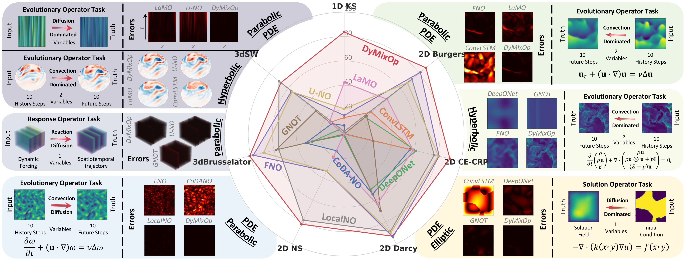
</p>
<p align="center"><i>DyMixOp achieves state-of-the-art performance across diverse PDE benchmarks, demonstrating superior accuracy in evolutionary, response, and solution operator tasks.</i></p>

## ✨ Highlights

- **Inertial Manifold Theory**: Reduces infinite-dimensional PDE dynamics into a finite-dimensional latent space while preserving critical nonlinear interactions
- **Local-Global-Mixing (LGM)**: A key innovation enabling effective capture of both fine-scale details and large-scale structures, mitigating spectral bias common in existing neural operators
- **Dynamics-Informed Architecture**: Connects multiple LGM layers approximating linear and nonlinear dynamics to reflect temporal evolution
- **State-of-the-Art Performance**: Achieves up to **94.3% error reduction** in convection-dominated scenarios while maintaining computational efficiency

## 📁 Project Structure

```
DyMixOp/
├── DyMixOp/
│   ├── main.py                 # Main entry point for training and inference
│   ├── Trainer.py              # Training loop and optimization
│   ├── Evaluator.py            # Model evaluation and metrics
│   ├── Preprocessor.py         # Data loading and preprocessing
│   ├── Visualizer.py           # Visualization utilities
│   ├── Loss.py                 # Loss functions
│   ├── utils.py                # Utility functions
│   ├── Models/                 # Neural operator implementations
│   │   ├── DyMixOp.py          # DyMixOp model (1D, 2D, 3D)
│   │   ├── FNO.py              # Fourier Neural Operator
│   │   ├── UNO.py              # U-shaped Neural Operator
│   │   ├── DeepONet.py         # Deep Operator Network
│   │   ├── GNOT.py             # General Neural Operator Transformer
│   │   ├── LaMO.py             # Latent Mapping Operator
│   │   ├── LaMO_utils.py       # LaMO utility functions
│   │   ├── LocalNO.py          # Local Neural Operator
│   │   ├── CoDANO.py           # Convolutional Domain-Agnostic NO
│   │   └── ConvLSTM.py         # Convolutional LSTM
│   ├── Configs/                # Configuration files organized by baseline
│   │   ├── README.md           # Configuration structure documentation
│   │   └── {baseline}/         # DyMixOp, FNO, UNO, etc.
│   │       ├── Base/           # Canonical configurations
│   │       └── Variants/       # Size/hyperparameter variants
│   ├── DataGeneration/         # Scripts for generating datasets
│   │   ├── 1dKS_generation.m        # 1D Kuramoto-Sivashinsky
│   │   ├── 2dBurgers_generation.m   # 2D Burgers equation
│   │   ├── 2dNS_generation.m        # 2D Navier-Stokes
│   │   ├── 3dsw_generation.py       # 3D Shallow Water generation
│   │   └── 3dsw_dataprocess.py      # 3D Shallow Water processing
│   └── Datasets/               # Dataset directory
├── assets/                     # Images and animations
├── environment-minimal.yml     # Conda environment specification
├── LICENSE                     # MIT License
└── README.md                   # Project documentation
```

## 🚀 Installation

### Setup

```bash
# Clone the repository
git clone https://github.com/your-username/DyMixOp.git
cd DyMixOp

# Create conda environment
conda env create -f environment-minimal.yml
conda activate neuralop

```

> [!NOTE]
> **LaMO Model**: If you want to use the LaMO baseline model, please set up a separate environment following the requirements at [LaMO repository](https://github.com/M3RG-IITD/LaMO/blob/main/requirements.txt).

## 📖 Usage

### Quick Start

```bash
cd DyMixOp

python main.py --config Configs/DyMixOp/Base/config_2dns_DyMixOp.json
# Training only (set "train": true, "inference": false, "visualize": false in config)
# Inference only (set "train": false, "inference": true, "visualize": false in config)
# Visualize only (set "train": false, "inference": false, "visualize": true in config)
```

### Configuration

All hyperparameters are controlled via JSON configuration files. Key sections include:

| Section | Description |
|---------|-------------|
| `data` | Dataset paths, dimensions, normalization, and input/output settings |
| `model` | Model architecture, hidden dimensions, number of layers, LGM modes |
| `training` | Epochs, batch size, learning rate, checkpointing |
| `visualization` | Visualization settings for comparing models |
| `loss` | Loss function types and weights |

**Example configuration:**

```json
{
  "device": "cuda:0",
  "verbose": 1,
  "data": {
    "dataset_path": "./Datasets/1dKS_1200x22x1x4096_dt1_t[100_120].mat",
    "dataset_name": "1dKS",
    "input_key": "uu",
    "output_key": "uu",
    "data_space_dim": 1,
    "ntrain": 1000,
    "ntest": 200,
    "input_dim": 1,
    "output_dim": 1
  },
  "model": {
    "model_name": "DyMixOp",
    "hidden_dim": 96,
    "num_layers": 4,
    "num_nonlinear": 1,
    "num_linear": 1,
    "global_modes": 12,
    "input_dim": 1,
    "output_dim": 1
  },
  "training": {
    "train": true,
    "inference": true,
    "visualize": true,
    "num_epochs": 500,
    "batch_size": 128,
    "lr": 1e-3
  },
  "visualization": {
    "visual_models": ["DyMixOp"],
    "visual_compare_dir_name": "Visualizations",
    "sample_idx": -1,
    "time_idx": -1,
    "channel_idx": 0
  },
  "loss": {
    "reccons_type": "relative_mse",
    "consist_type": "relative_mse",
    "weight_reccons": 1.0,
    "weight_consist": 0.0
  }
}
```

### Command Line Arguments

| Argument | Description | Default |
|----------|-------------|---------|
| `--config` | Path to configuration file | `Configs/DyMixOp/Base/config_2dns_DyMixOp.json` |
| `--physical_gpu_id` | GPU ID for logging | `0` |

> [!NOTE]
> Configuration files are organized by baseline model. See [Configs/README.md](DyMixOp/Configs/README.md) for detailed structure and parameter explanations.

## 🧠 Model Architecture

DyMixOp is designed as a structured approximation of the reduced evolutionary operator, explicitly respecting dynamics on an inertial manifold.

<p align="center">
  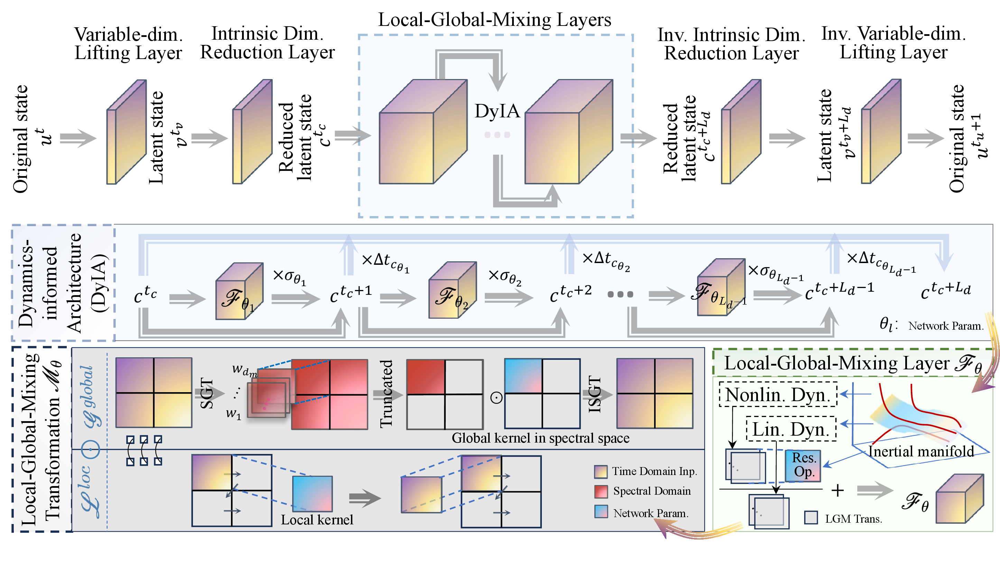
</p>
<p align="center"><i>DyMixOp architecture: Variable-dim lifting, intrinsic dimension reduction, Local-Global-Mixing layers with dynamics-informed architecture (DyIA), and inverse transformations.</i></p>

### Key Components

1. **Lifting (𝒯)** and **Reduction (𝒫ₘ)**: Maps input to latent space with intrinsic dimension reduction (their inverse transformations are denoted as 𝒯⁻¹ and 𝒫⁻¹ₘ and are used for mapping back to the original space)
2. **Linear LGM (𝓜^𝓛)**: Approximates the linear component of reduced dynamics
3. **Nonlinear LGM (𝓜^𝓝)**: Local-Global-Mixing transformation (Hadamard product of Fourier global and convolutional local features) for nonlinear dynamics
4. **𝒜 Operator**: Captures residual local corrections on the nonlinear branch output for unresolved scales
5. **Parallel Aggregation**: Combines outputs across layers with learnable weights for adaptive time-integration

## 📊 Supported Datasets

| Dataset | Dimension | Description |
|---------|-----------|-------------|
| 1D KS | 1D | Kuramoto-Sivashinsky equation |
| 2D Burgers | 2D | Viscous Burgers equation |
| 2D NS | 2D | Navier-Stokes equations |
| 2D Darcy | 2D | Darcy flow |
| 2D CE-CRP | 2D | Convection-Enhanced CRP |
| 3D Brusselator | 3D | Brusselator reaction-diffusion |
| 3D SW | 3D | Shallow water equations |

### Download Datasets

[](https://huggingface.co/datasets/Lai-PY/DyMixOp-Benchmarks)

All benchmark datasets are available on Hugging Face:

👉 **[DyMixOp-Benchmarks](https://huggingface.co/datasets/Lai-PY/DyMixOp-Benchmarks)**

Download and place the datasets in the `Datasets/` directory.

### Data Generation

Scripts for generating datasets are provided in `DataGeneration/`:

- `1dKS_generation.m` - MATLAB script for 1D Kuramoto-Sivashinsky
- `2dBurgers_generation.m` - MATLAB script for 2D Burgers
- `2dNS_generation.m` - MATLAB script for 2D Navier-Stokes
- `3dsw_generation.py` - Python script for 3D Shallow Water

## 🔧 Extending the Framework

### Adding New Models

New models must follow this interface:

```python
class CustomModel(nn.Module):
    def __init__(self, model_config, device):
        super().__init__()
        # Extract parameters from model_config
        self.input_dim = model_config.input_dim
        self.hidden_dim = model_config.hidden_dim
        # ... build layers ...
        
    def forward(self, x, static_data):
        """
        Args:
            x: (B, T*C, H, W, ...) - Temporal snapshots
            static_data: List[Tensor] - Static features (e.g., coordinates)
        Returns:
            (B, seq_len, C, H, W, ...) - Predicted sequence
        """
        # Concatenate static data
        coor_input = static_data[0]
        # ... model forward pass ...
        return output
```

**Key requirements:**

- Initialize using only `model_config` and `device`
- Handle autoregressive prediction internally
- Input shape: `(Batch, TimeSteps × Channels, Height[, Width, ...])`
- Output shape: `(Batch, SeqLength, Channels, Height[, Width, ...])`

## 🎬 Visualization

Animated comparisons of model predictions across different benchmarks showing ground truth evolution alongside predictions from multiple baseline models with real-time error tracking.

| **1D Kuramoto-Sivashinsky**<br>*(scalar u)* | **2D Burgers**<br>*(velocity u)* |
|:--:|:--:|
| 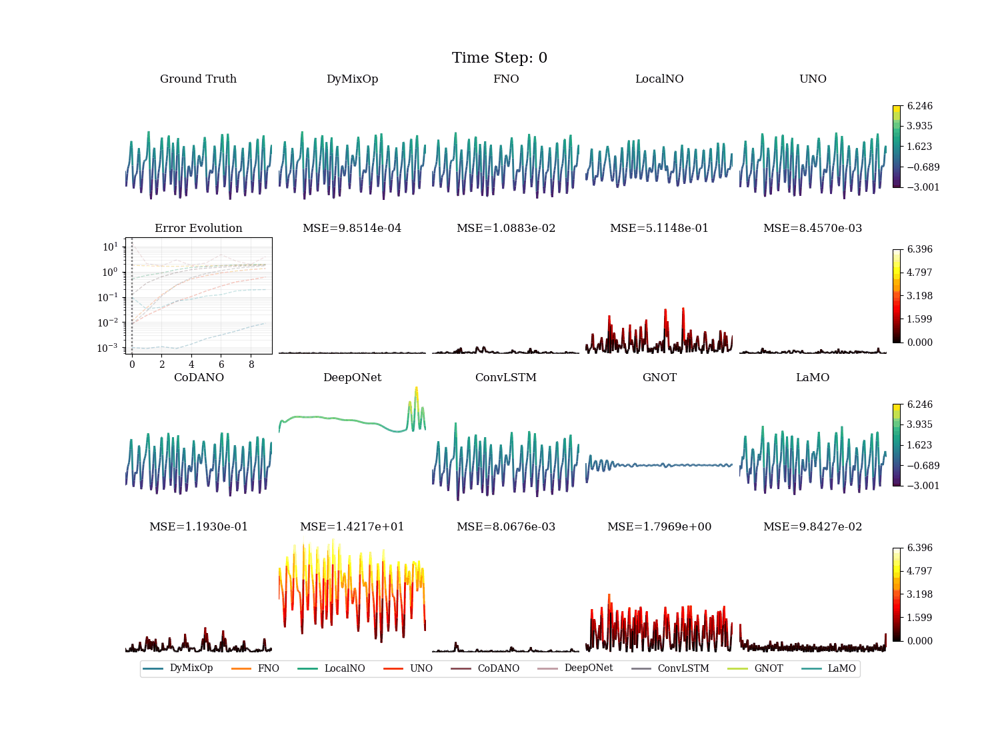 | 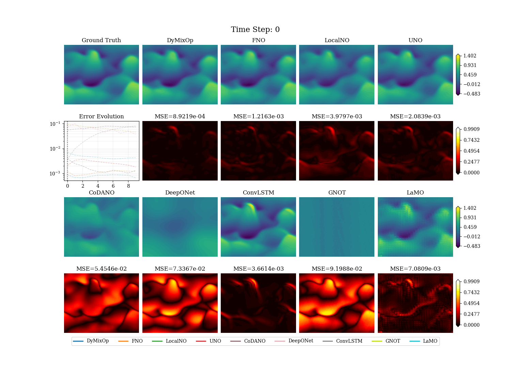 |
| **2D Burgers**<br>*(velocity v)* | **2D Navier-Stokes**<br>*(vorticity ω)* |
| 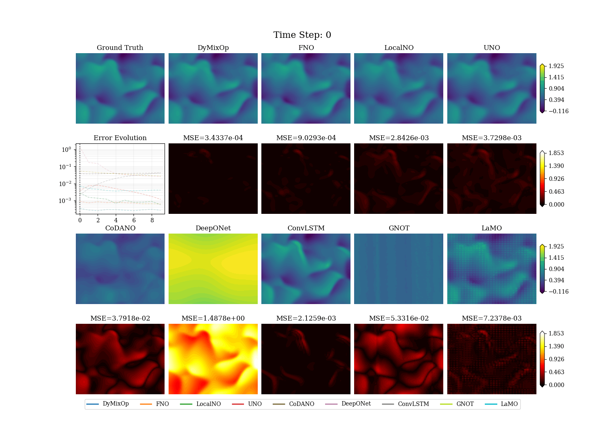 | 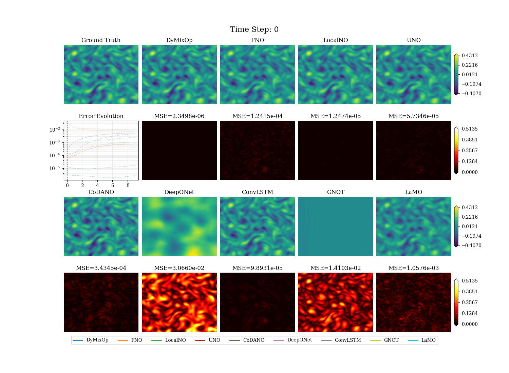 |
| **3D Shallow Water**<br>*(height h)* | **3D Shallow Water**<br>*(vorticity ω)* |
|  | 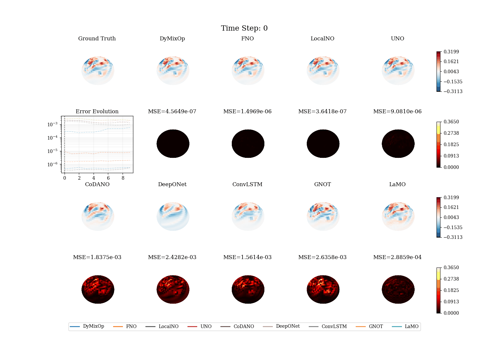 |
| **2D CE-CRP**<br>*(density ρ)* | **2D CE-CRP**<br>*(velocity u)* |
| 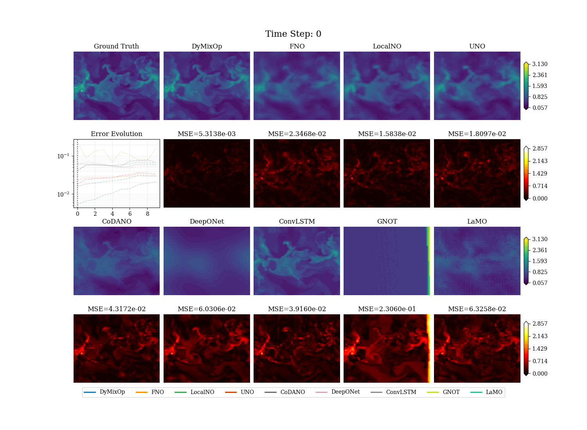 | 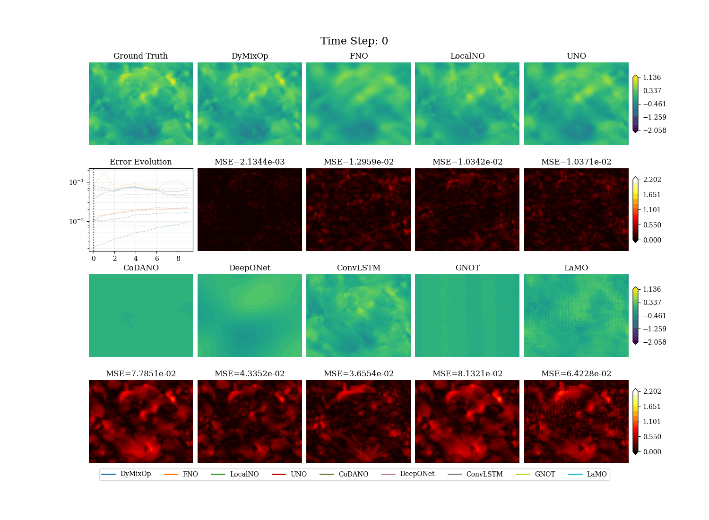 |
| **2D CE-CRP**<br>*(velocity v)* | **2D CE-CRP**<br>*(pressure p)* |
| 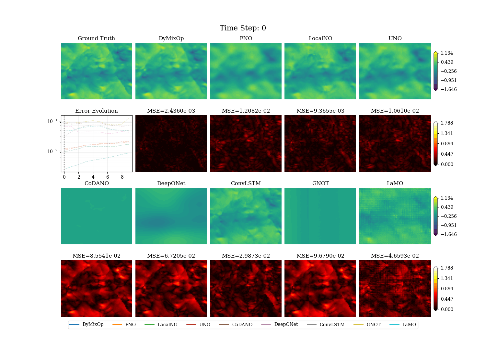 | 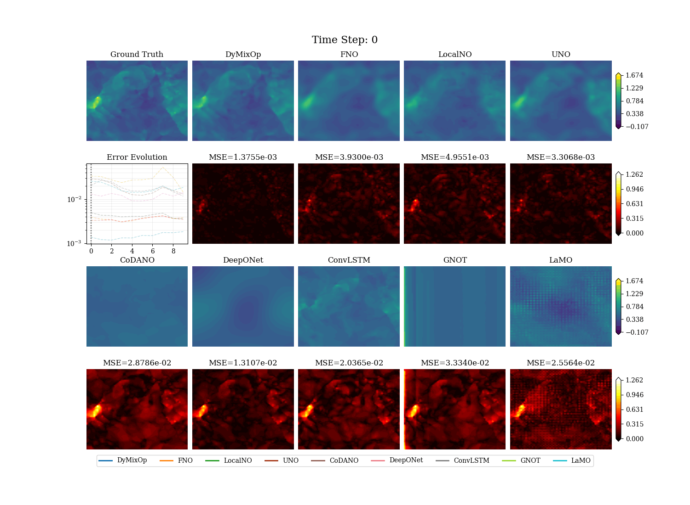 |
| **2D CE-CRP**<br>*(energy E)* | |
| 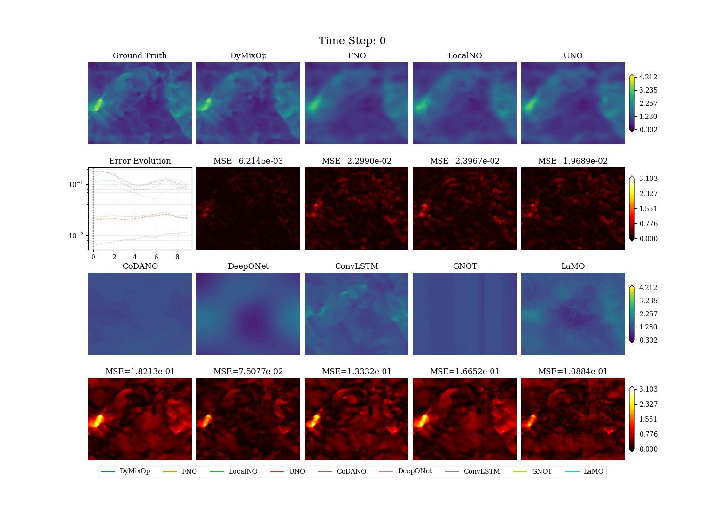 | |

<p align="center"><i>Note: LaMO baseline excluded from the height in 3D Shallow Water visualization due to scale mismatch</i></p>

## 📈 Results

DyMixOp achieves state-of-the-art performance across diverse PDE benchmarks:

<p align="center">
  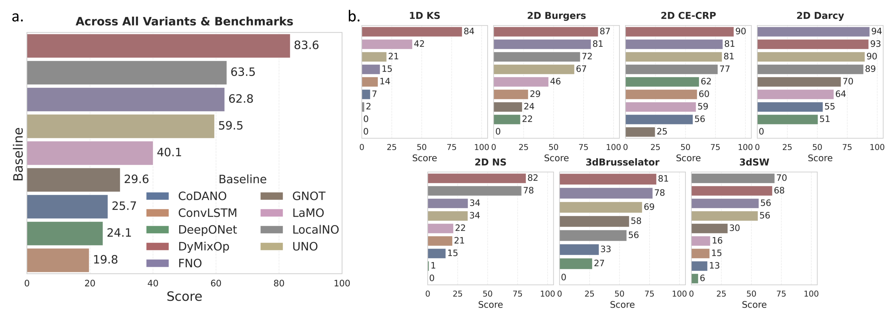
</p>
<p align="center"><i>Benchmark results across all datasets. DyMixOp consistently achieves the highest scores, demonstrating superior accuracy across 1D, 2D, and 3D PDE benchmarks.</i></p>

## 📄 Citation

If you find this work useful, please cite:

```bibtex
@article{lai2025dymixop,
  title={DyMixOp: Guiding Neural Operator Design for PDEs from a Complex Dynamics Perspective with Local-Global-Mixing},
  author={Lai, Pengyu and Chen, Yixiao and Xu, Hui},
  journal={arXiv preprint arXiv:2508.13490},
  year={2025}
}
```

## 📜 License

This project is licensed under the MIT License - see the [LICENSE](LICENSE) file for details.

## 🤝 Contributing

Contributions are welcome! Please feel free to submit a Pull Request.

1. Fork the repository
2. Create your feature branch (`git checkout -b feature/AmazingFeature`)
3. Commit your changes (`git commit -m 'Add some AmazingFeature'`)
4. Push to the branch (`git push origin feature/AmazingFeature`)
5. Open a Pull Request
